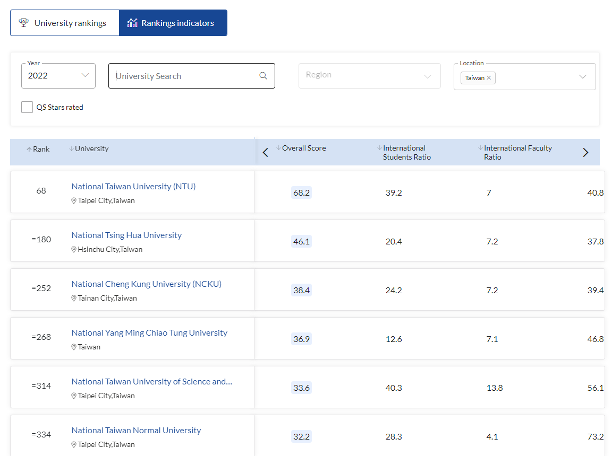
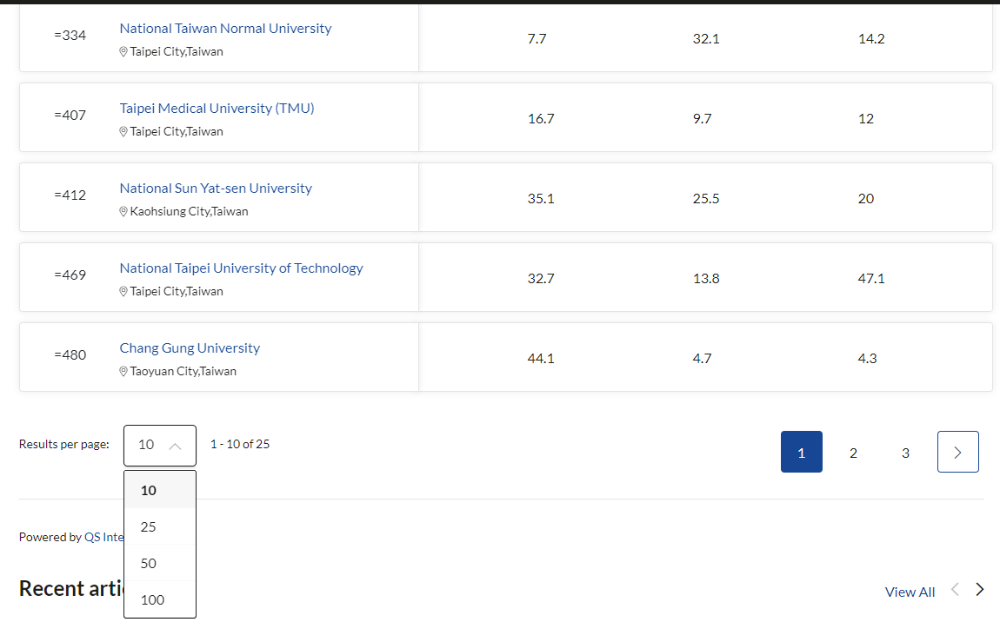
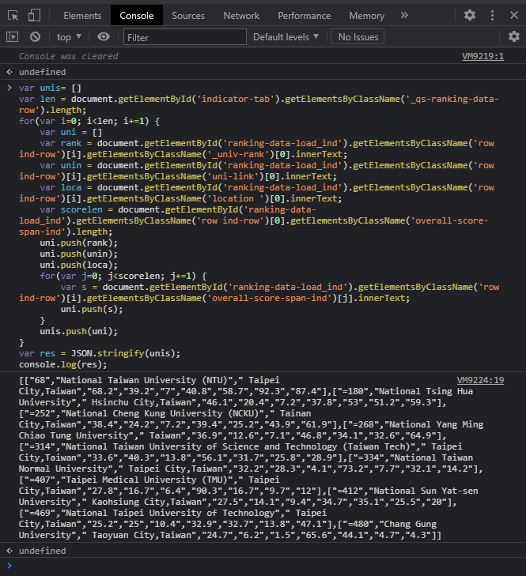

# QS Ranking

&copy; 陳沛均 Jessica，校務研究辦公室資料工程師，最新更新日期 2021/06

此文件說明 QS Ranking 資料整理相關說明

## QS 網站資料擷取

由於目前網站不提供便利的資料擷取方式，以下採用 JavaScript 做網頁資料萃取，資料轉為 JSON 格式後，再利用線上 JSON to Excel/CSV 的網站轉為所需檔案。

目前程式支援 2022 的網頁設計，若未來資料欄位名稱有改，可能須做部分修改

請依以下步驟完成資料萃取

1. 至排名分數的頁面，篩選資料範圍 (包含：年份、地區、資料筆數)

    

    資料比數請選還蓋所有資料範圍的最大值。如：共有15間學校上榜，資料筆數請選每頁25筆(或以上)

    

2. 按 `F12` 開啟網頁 console (`終端`) 頁面，將以下程式碼貼上並按 `Enter`

    若 console 頁面有紅字 warning 可忽略不管

    ``` JavaScript
    var unis= []
    var len = document.getElementById('indicator-tab').getElementsByClassName('_qs-ranking-data-row').length;
    for(var i=0; i<len; i+=1) {
        var uni = []
        var rank = document.getElementById('ranking-data-load_ind').getElementsByClassName('row ind-row')[i].getElementsByClassName('_univ-rank')[0].innerText;
        var unin = document.getElementById('ranking-data-load_ind').getElementsByClassName('row ind-row')[i].getElementsByClassName('uni-link')[0].innerText;
        var loca = document.getElementById('ranking-data-load_ind').getElementsByClassName('row ind-row')[i].getElementsByClassName('location ')[0].innerText;
        var scorelen = document.getElementById('ranking-data-load_ind').getElementsByClassName('row ind-row')[0].getElementsByClassName('overall-score-span-ind').length; 
        uni.push(rank);
        uni.push(unin);
        uni.push(loca);
        for(var j=0; j<scorelen; j+=1) {
            var s = document.getElementById('ranking-data-load_ind').getElementsByClassName('row ind-row')[i].getElementsByClassName('overall-score-span-ind')[j].innerText;
            uni.push(s);
        }
        unis.push(uni);
    }
    var res = JSON.stringify(unis);
    console.log(res);
    ```
    
    範例畫面
    

3. 將擷取出來的結果，即中括號內的所有資料 `[[ ]]`，兩層中括號都要複製到。

4. 至 [https://json-csv.com/](https://json-csv.com/) 或其他線上資料轉換器 (JSON to Excel/CSV)，將步驟 3 的資料貼上，下載資料即可得到所需資料。

