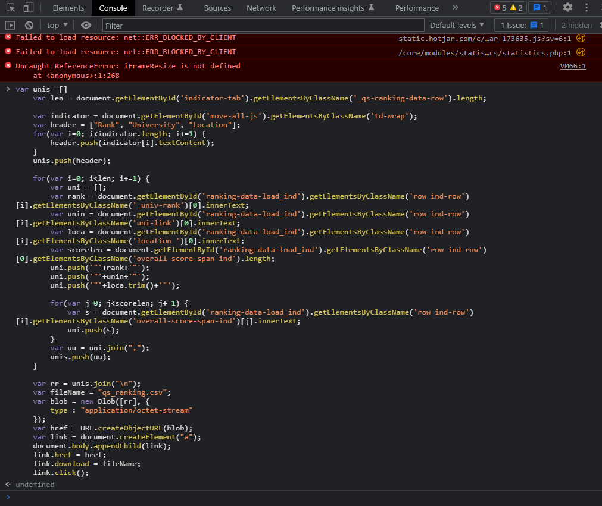

# THE Rankings & QS Rankings

&copy; 陳沛均 Jessica，校務研究辦公室資料工程師，最新更新日期 2022/09

此文件說明 THE, QS Ranking 官網資料下載整理

---

## QS 網站資料擷取

由於目前網站不提供便利的資料擷取方式，以下採用 JavaScript 做網頁資料萃取，自動下載檔案名稱為 "qs_ranking" 的 csv 檔案

目前程式支援 2022 的網頁設計，若未來資料欄位名稱有改，可能須做部分修改

請依以下步驟完成資料萃取

1. 至排名分數的頁面，篩選資料範圍 (包含：年份、地區、資料筆數)

    

    資料比數請選還蓋所有資料範圍的最大值。如：共有15間學校上榜，資料筆數請選每頁25筆(或以上)

    

2. 按 `F12` 開啟網頁 console (`終端`) 頁面，將以下程式碼貼上並按 `Enter`

    若 console 頁面有紅字 warning 可忽略不管

    ``` JavaScript
    var unis= []
    var len = document.getElementById('indicator-tab').getElementsByClassName('_qs-ranking-data-row').length;

    var indicator = document.getElementById('move-all-js').getElementsByClassName('td-wrap'); 
    var header = ["Rank", "University", "Location"];
    for(var i=0; i<indicator.length; i+=1) {
        header.push(indicator[i].textContent);
    }
    unis.push(header);

    for(var i=0; i<len; i+=1) {
        var uni = [];
        var rank = document.getElementById('ranking-data-load_ind').getElementsByClassName('row ind-row')[i].getElementsByClassName('_univ-rank')[0].innerText;
        var unin = document.getElementById('ranking-data-load_ind').getElementsByClassName('row ind-row')[i].getElementsByClassName('uni-link')[0].innerText;
        var loca = document.getElementById('ranking-data-load_ind').getElementsByClassName('row ind-row')[i].getElementsByClassName('location ')[0].innerText;
        var scorelen = document.getElementById('ranking-data-load_ind').getElementsByClassName('row ind-row')[0].getElementsByClassName('overall-score-span-ind').length; 
        uni.push('"'+rank+'"');
        uni.push('"'+unin+'"');
        uni.push('"'+loca.trim()+'"');
        
        for(var j=0; j<scorelen; j+=1) {
            var s = document.getElementById('ranking-data-load_ind').getElementsByClassName('row ind-row')[i].getElementsByClassName('overall-score-span-ind')[j].innerText;
            uni.push(s);
        }
        var uu = uni.join(",");
        unis.push(uu);
    }

    var rr = unis.join("\n");
    var fileName = "qs_ranking.csv";
    var blob = new Blob([rr], {
        type : "application/octet-stream"
    });
    var href = URL.createObjectURL(blob);
    var link = document.createElement("a");
    document.body.appendChild(link);
    link.href = href;
    link.download = fileName;
    link.click();
    ```

    範例畫面

    

3. 貼上後，會跳出自動下載 csv 檔

---

### THE 網站擷取

為方便批次下載 THE Ranking 各校成績，以下採用 JavaScript 做網頁資料萃取，自動下載檔案名稱為 "the_ranking" 的 csv 檔案，以利後續資料處理。
目前程式支援 2022 的網頁設計，若未來資料欄位名稱有改，可能須做部分修改

請依以下步驟完成資料萃取

1. 至排名分數 Scores 的頁面，篩選資料範圍

2. 建議資料筆數直接選 All，可整批下載
3. 按 `F12` 開啟網頁 console (`終端`) 頁面，將以下程式碼貼上並按 `Enter`
    若 console 頁面有紅字 warning 可忽略不管

    ``` JavaScript

    var unis= []
    var len = document.getElementById('datatable-1').rows.length;

    var indicator = ['overall-score', 'teaching-score', 'research-score', 'citations-score', 'industry_income-score', 'international_outlook-score'];
    var header = ['Rank', 'University', 'Location'].concat(indicator);
    unis.push(header);
    for (var i=0; i<len-1; i++) {
        var uni = [];
        var rank = document.getElementById('datatable-1').getElementsByClassName('sorting_1')[i].innerText;
        if(rank == "Reporter") continue;
        var title = document.getElementById('datatable-1').getElementsByClassName('ranking-institution-title')[i].innerText;
        var loc = document.getElementById('datatable-1').getElementsByClassName('location')[i].innerText;
        uni.push('"'+rank+'"');
        uni.push('"'+title+'"');
        uni.push('"'+loc.trim()+'"');
        for(var j=0; j<6; j++) {
            var s = document.getElementById('datatable-1').getElementsByClassName(indicator[j])[i+1].innerText;
            uni.push(s);
        }

        unis.push(uni);

    }
    // var res = JSON.stringify(unis);
    // console.log(res);

    var rr = unis.join("\n");
    var fileName = "the_ranking.csv";
    var blob = new Blob([rr], {
        type : "application/octet-stream"
    });
    var href = URL.createObjectURL(blob);
    var link = document.createElement("a");
    document.body.appendChild(link);
    link.href = href;
    link.download = fileName;
    link.click();

    ```

4. 貼上後，會跳出自動下載 csv 檔